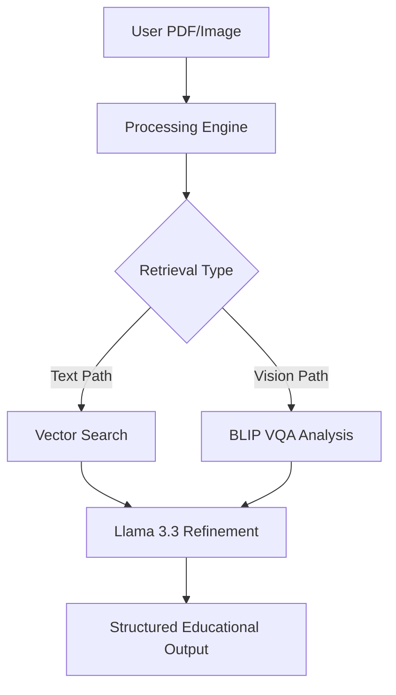

# 🪐 Edulevel+ | Next-Gen AI Tutor

[](https://github.com/yogesh968/edulevel-)
[-orange)](https://groq.com)
[](https://huggingface.co/Salesforce/blip-vqa-base)

**Edulevel+** is a sophisticated, multimodal AI tutoring platform that transforms stagnant PDF textbooks into interactive, high-intelligence learning experiences. By combining **RAG (Retrieval-Augmented Generation)** with **Vision AI**, students can chat with their documents and analyze complex diagrams in real-time.

---

## ✨ Core Features

### 🧠 High-Intelligence Reasoning
Powered by **Llama 3.3 (70B) via Groq**, the tutor provides world-class educational explanations. It features a "Smart-Switch" logic:
- **Crisp Mode:** Short, 2-3 sentence answers for simple facts.
- **Professor Mode:** Deep, multi-section elaborations with headers for complex topics.

### 👁️ Multimodal Vision Analysis
Integrated with **Salesforce BLIP VQA**, the platform can "see" your uploads.
- Analyze diagrams, charts, and handwritten notes.
- Direct question-answering based on visual pixels.
- Automated image compression (WebP/JPEG) for instant analysis.

### 📚 PDF Context-Awareness (RAG)
Unlike standard chatbots, Edulevel+ uses your documents as a "Source of Truth":
- Fast text-chunking and semantic search.
- Contextual grounding to prevent AI hallucinations.
- Textbook-style rendering of relevant diagrams.

### 💎 Premium Glassmorphic UI
- **Responsive Design:** Optimized for Mobile and Desktop.
- **Rich Aesthetics:** Dark-mode focus with vibrant gradients and smooth micro-animations.
- **Smart Lightbox:** View textbook diagrams in high definition.

---

## 🛠️ Technical Architecture



---

## 🚀 Getting Started

### 1. Prerequisites
- **Node.js** (v18+)
- **Groq API Key** (Get it at [console.groq.com](https://console.groq.com))
- **Hugging Face Token** (Get it at [huggingface.co/settings/tokens](https://huggingface.co/settings/tokens))

### 2. Installation

#### Backend Setup
```bash
cd backend
npm install
```

#### Frontend Setup
```bash
cd frontend
npm install
```

### 3. Environment Variables
Create a `.env` file in the `backend/` directory:
```env
GROQ_API_KEY=your_key_here
HF_TOKEN=your_token_here
PORT=3003
```

### 4. Launch
Start the backend:
```bash
# In /backend
npm start
```

Start the frontend:
```bash
# In /frontend
npm run dev
```

---

## 🗺️ Roadmap
- [x] Integrate Llama 3.3 (70B) Reasoning.
- [x] Implement BLIP Vision Analysis.
- [x] Add Smart-Brevity switching.
- [ ] Support for LaTeX mathematical rendering.
- [ ] Real-time speech-to-text for audio questions.

---

## 📄 License
This project is for educational purposes. Feel free to fork and enhance!

**Developed with ❤️ by Yogesh Kumar**
