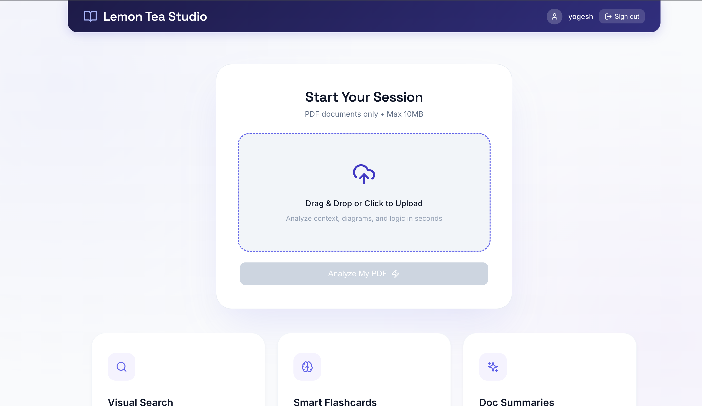
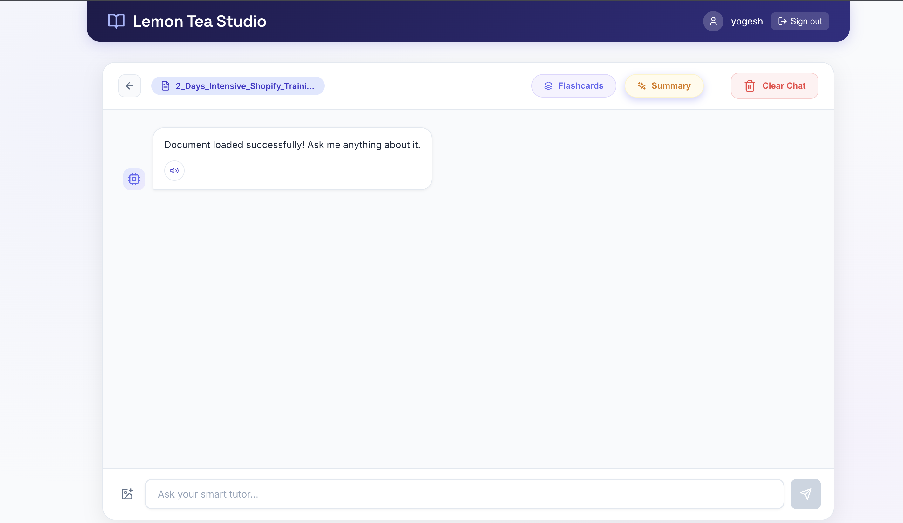
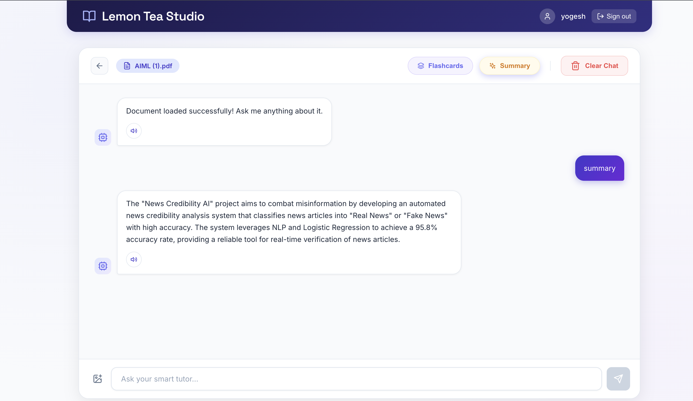
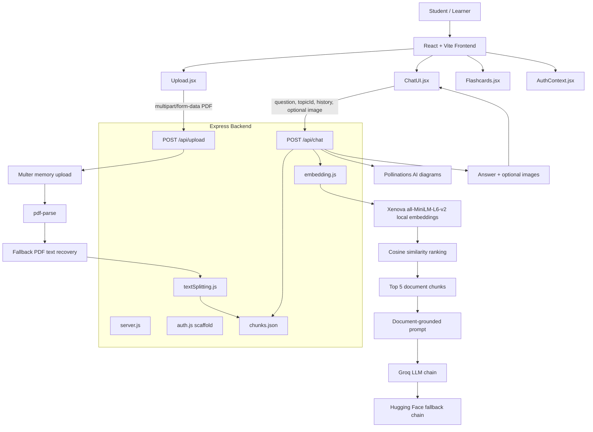

# In this I have answers of questions that was given (https://drive.google.com/file/d/1WaU7DK5o2lT3sIihzEY03KHXmeCFT44u/view?usp=sharing)

# Lemon Tea Studio

**Lemon Tea Studio** is a polished document-grounded AI tutoring workspace built for fast PDF learning sessions. Upload a PDF, ask questions in natural language, generate summaries, create flashcards, request diagrams, attach images for visual analysis, and listen to responses inside a clean premium study interface.




---

## Product Snapshot

| Area | Specification |
| --- | --- |
| Product type | AI PDF tutor and study assistant |
| Frontend | React 18, Vite 5, React Router, Axios, React Markdown, Lucide icons |
| Backend | Node.js, Express, Multer, pdf-parse |
| Retrieval | Local semantic retrieval with `@xenova/transformers` and `all-MiniLM-L6-v2` |
| Primary LLM | Groq-hosted chat models |
| Fallback LLMs | Hugging Face hosted text and vision models |
| Diagram generation | Pollinations AI image endpoint |
| Upload support | PDF documents only |
| Upload limit | 10MB per PDF |
| Session storage | `topicId`, `pdfName`, and chat messages persisted in browser `localStorage` |
| Chunk storage | Local JSON file in `backend/data/chunks.json`, or `/tmp/chunks.json` on Vercel |
| Deployment target | Vercel-ready frontend and backend configs |

---

## Experience

### 1. Start a Study Session

The opening screen uses a focused, high-contrast upload card with a dark indigo brand bar, soft borders, and clear PDF constraints.


Highlights:

- Drag-and-drop or click-to-upload PDF flow
- PDF-only validation
- 10MB backend upload limit
- Disabled action state until a valid PDF is selected
- Feature cards for visual search, smart flashcards, and document summaries

### 2. Ask the Document

After upload, the app opens a focused tutor chat around the active PDF. The header keeps the file name visible, while study actions stay one click away.



Highlights:

- Active document pill with truncated PDF filename
- Flashcards action
- Summary action
- Clear chat action
- Image attachment button for visual questions
- Speech button on assistant responses
- Persistent per-document chat history

### 3. Generate a Summary

The summary action sends a structured prompt to the RAG backend and returns a concise document-grounded explanation in the chat.



Highlights:

- One-click summary request
- Assistant response grounded in retrieved PDF chunks
- Voice playback for responses
- Clean alternating chat layout with assistant and user states

---

## Core Features

- **PDF ingestion**: Upload a searchable PDF and extract its text with `pdf-parse`.
- **RAG tutoring**: Ask natural language questions and retrieve the most relevant document chunks before answering.
- **Smart summaries**: Generate point-by-point summaries from the uploaded document.
- **Flashcards**: Create high-yield study flashcards from the document context.
- **Diagram requests**: Ask for a diagram, chart, illustration, or visual and receive an AI-generated educational image.
- **Image-assisted questions**: Attach an image alongside a question for multimodal study workflows.
- **Voice playback**: Listen to assistant answers with the browser SpeechSynthesis API.
- **Session memory**: Keep the active PDF, topic id, and chat history in `localStorage`.
- **Model resilience**: Use Groq as the primary inference provider with Hugging Face fallbacks.
- **Deployable split stack**: Frontend and backend each include Vercel configuration.

---

## Full Architecture



---

## Runtime Flow

### Upload Pipeline

1. The user selects a PDF from the upload screen.
2. `Upload.jsx` sends the file to `POST /api/upload`.
3. `multer` keeps the file in memory and enforces a 10MB limit.
4. `pdf-parse` extracts selectable text.
5. If normal parsing fails, the backend attempts a lightweight text recovery pass from PDF internals.
6. `textSplitting.js` splits the extracted text into roughly 400-word chunks.
7. A new UUID `topicId` is created for the document session.
8. Chunks are written to JSON storage with `{ id, topicId, text }`.
9. The frontend stores `topicId` and `pdfName` in `localStorage`.

### Question Answering Pipeline

1. The user asks a question in `ChatUI.jsx`.
2. The frontend sends `topicId`, `question`, recent `history`, and optional image data to `POST /api/chat`.
3. The backend loads chunks for the active `topicId`.
4. The query and document chunks are embedded locally with `all-MiniLM-L6-v2`.
5. Cosine similarity ranks the chunks.
6. The top 5 chunks are injected into a document-context prompt.
7. The model answers as a premium AI tutor using retrieved context.
8. The answer returns to the chat UI and is saved to browser history.

### Diagram Pipeline

1. The backend detects image-style requests with keywords such as `diagram`, `visual`, `chart`, `illustration`, or `draw`.
2. It extracts useful prompt keywords from the user request or document content.
3. It builds a Pollinations image URL with an educational diagram prompt.
4. It polls briefly until an image response is ready.
5. The chat UI renders the generated image in a diagram card.

---

## API Reference

### `GET /api/health`

Returns a lightweight backend health check.

```json
{
  "status": "API is online and matching routes"
}
```

### `POST /api/upload`

Uploads and processes a PDF.

Request:

```http
Content-Type: multipart/form-data
file=<document.pdf>
```

Successful response:

```json
{
  "success": true,
  "topicId": "uuid",
  "message": "Processed 12 chunks."
}
```

Validation:

- Only PDF files are accepted.
- Files larger than 10MB are rejected.
- Password-protected or unreadable PDFs return a clear error.

### `POST /api/chat`

Asks a question about the active document.

Request:

```json
{
  "topicId": "uuid",
  "question": "Summarize this document.",
  "history": [
    { "role": "assistant", "text": "Document loaded successfully!" }
  ],
  "image": null
}
```

Successful response:

```json
{
  "answer": "The document explains...",
  "images": [],
  "userImage": null
}
```

Diagram response:

```json
{
  "answer": "Here is a diagram for machine learning.",
  "images": [
    {
      "url": "https://image.pollinations.ai/prompt/...",
      "title": "machine learning",
      "description": "AI-generated diagram: machine learning"
    }
  ],
  "userImage": null
}
```

---

## LLM Strategy

The backend is designed to avoid failing on a single unavailable model. It starts with Groq and falls back through additional Groq and Hugging Face options.

```text
Groq: llama-3.1-8b-instant
  -> llama-3.3-70b-versatile
  -> mixtral-8x7b-32768
  -> gemma2-9b-it
    -> HF: Mistral-7B-Instruct
    -> HF: Zephyr-7B
    -> HF: Phi-3-mini
    -> HF: Gemma-2-2b
    -> HF: Falcon-7B-Instruct
```

The retrieval layer remains local, so embeddings do not require a hosted vector database or paid embedding API.

---

## Project Structure

```text
edulevel-/
├── README.md
├── LICENSE
├── docs/
│   └── screenshots/
│       ├── upload-session.png
│       ├── chat-ready.png
│       └── summary-response.png
├── backend/
│   ├── data/
│   │   ├── .gitkeep
│   │   └── chunks.json
│   ├── routes/
│   │   ├── auth.js
│   │   ├── chat.js
│   │   └── upload.js
│   ├── utils/
│   │   ├── embedding.js
│   │   └── textSplitting.js
│   ├── package.json
│   ├── server.js
│   └── vercel.json
└── frontend/
    ├── src/
    │   ├── components/
    │   │   ├── ChatUI.jsx
    │   │   ├── Flashcards.jsx
    │   │   └── Upload.jsx
    │   ├── context/
    │   │   └── AuthContext.jsx
    │   ├── pages/
    │   │   ├── AuthCallback.jsx
    │   │   ├── Login.jsx
    │   │   └── Signup.jsx
    │   ├── App.jsx
    │   ├── index.css
    │   └── main.jsx
    ├── package.json
    ├── vite.config.js
    └── vercel.json
```

---

## Frontend Details

The frontend is intentionally lightweight and custom-styled.

- `App.jsx` owns the top-level protected experience, header, active PDF state, and routes.
- `Upload.jsx` manages PDF validation, upload state, and the onboarding card.
- `ChatUI.jsx` manages question input, message persistence, voice playback, image upload, summary generation, flashcards, and diagram rendering.
- `Flashcards.jsx` displays generated study cards.
- `AuthContext.jsx` keeps the auth boundary in place so production auth can be wired without reshaping the app.
- `index.css` defines the premium visual system: indigo brand header, white cards, soft borders, restrained shadows, and responsive chat structure.

---

## Backend Details

The backend keeps the learning pipeline simple and inspectable.

- `server.js` configures CORS, JSON limits, route mounting, CSP headers, health check, and local server startup.
- `routes/upload.js` accepts PDFs, parses text, chunks content, creates a `topicId`, and stores chunks.
- `routes/chat.js` retrieves document chunks, ranks relevant context, handles diagram requests, and calls the LLM wrapper.
- `utils/textSplitting.js` controls chunk size for retrieval.
- `utils/embedding.js` owns local embeddings, similarity support, and model fallback calls.

---

## Local Setup

### Prerequisites

- Node.js 18 or newer
- Groq API key
- Hugging Face token for fallback model access and BLIP visual question answering

### Install Dependencies

```bash
cd backend
npm install

cd ../frontend
npm install
```

### Configure Environment

Create `backend/.env`:

```env
GROQ_API_KEY=your_groq_key
HF_TOKEN=your_huggingface_token
PORT=3003
FRONTEND_URL=http://localhost:5173
```

Optional frontend environment:

```env
VITE_API_URL=http://localhost:3003
```

### Run Locally

Terminal 1:

```bash
cd backend
npm start
```

Terminal 2:

```bash
cd frontend
npm run dev
```

Local URLs:

- Frontend: `http://localhost:5173`
- Backend: `http://localhost:3003`
- Health check: `http://localhost:3003/api/health`

---

## Deployment Notes

- The backend includes `backend/vercel.json`.
- The frontend includes `frontend/vercel.json`.
- When `VERCEL=1`, chunk storage moves to `/tmp/chunks.json`.
- For production, set `GROQ_API_KEY`, `HF_TOKEN`, and `FRONTEND_URL` in the backend deployment environment.
- If the frontend and backend are deployed separately, set `VITE_API_URL` to the backend origin.

---

## Current Assumptions

- Best results come from searchable PDFs with selectable text.
- Image-only scans are accepted but cannot produce strong document-grounded answers unless text can be recovered.
- The current storage model is file-based and best suited for local development, demos, and serverless prototypes.
- Auth screens and routes exist, but the current product flow is optimized around a lightweight study-session experience.
- Data isolation should be upgraded before using this as a multi-user production learning platform.

---

## Roadmap

- Add OCR for scanned PDFs.
- Add persistent database storage for users, documents, chunks, and conversations.
- Add vector database support for larger document libraries.
- Add streaming responses for a faster perceived tutoring experience.
- Add export options for summaries and flashcards.
- Add role-based auth and per-user document isolation.

---

## Author

Built by **Yogesh Kumar**.
